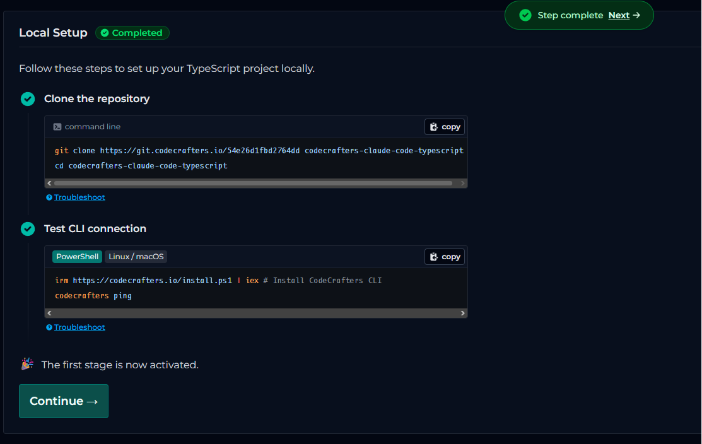

# Local Setup

| ← Previous | Next → |
|------------|--------|
| [README](ReadMe.md) | [Stage 1](ReadMe.md#stages) |

**Status:** Completed

Follow these steps to set up your TypeScript project locally.



---

## 1. Clone the repository

```bash
git clone https://git.codecrafters.io/54e26d1fbd2764dd codecrafters-claude-code-typescript
cd codecrafters-claude-code-typescript
```

*Troubleshoot*

---

## 2. Test CLI connection

### PowerShell

```powershell
irm https://codecrafters.io/install.ps1 | iex # Install CodeCrafters CLI
codecrafters ping
```

### Linux / macOS

```bash
curl -fsSL https://codecrafters.io/install.sh | bash # Install CodeCrafters CLI
codecrafters ping
```

*Troubleshoot*

---

## Done

The first stage is now activated. Continue to **Stage 1: Communicate with the LLM**.

---

| ← Previous | Next → |
|------------|--------|
| [README](ReadMe.md) | [Stage 1](ReadMe.md#stages) |
